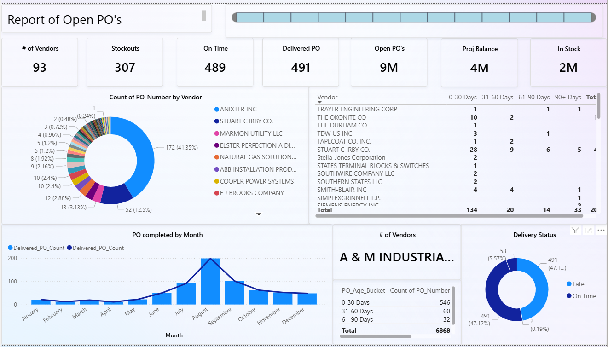

# Open POs Analytics

This project analyzes open purchase orders, vendor performance, and delivery metrics using Power BI.

## Contents
- **docs/methodology.md** – [Methodology](docs/methodology.md) used for definitions and assumptions.
- `powerbi/` – Power BI report or template files.
- `images/` – Screenshots and visuals.

## Quick Preview
  <!-- Optional if you add your screenshot here -->

## How to Use
1. Download the `.pbit` template (in `powerbi/`).
2. Open in Power BI Desktop.
3. Connect to your data source.

## License
MIT or your preferred license.
